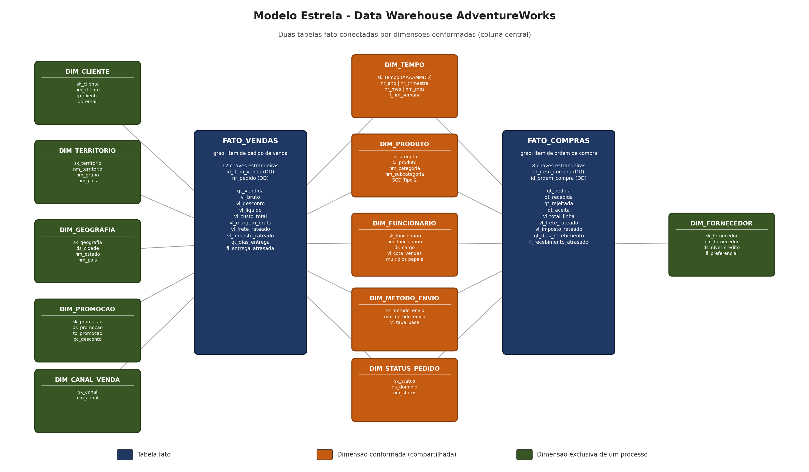

# Data Warehouse AdventureWorks — Modelagem Multidimensional e ETL Incremental

Projeto acadêmico de Análise e Fluxo de Dados (OLAP e ETL). Constrói um Data
Warehouse em **PostgreSQL 16** a partir da base transacional **AdventureWorks**
(SQL Server), utilizando modelagem **Star Schema** e uma **ETL incremental**
escrita em Python.

| Item | Escolha |
|---|---|
| Origem (OLTP) | SQL Server — `AdventureWorks2022` |
| Destino (OLAP) | PostgreSQL 16 em contêiner Docker |
| Modelagem | Star Schema — 2 fatos, 11 dimensões, 5 delas conformadas |
| Historização | SCD Tipo 2 em `dim_produto`; SCD Tipo 1 nas demais |
| Estratégia incremental | Marca d'água (*high-water mark*) sobre `ModifiedDate` |
| Indicadores | 10 KPIs implementados em SQL sobre o modelo |
| Volume carregado | 170.525 registros — carga completa em ~18 s |



---

## 1. Estrutura do repositório

```
dw-adventureworks-produto1/
├── docker-compose.yml          Ambiente PostgreSQL 16 + Adminer
├── .env.example                Modelo de configuração (copiar para .env)
├── requirements.txt            Dependências Python
│
├── sql/
│   ├── 01_ddl_dw.sql           DDL completo: schemas, dimensões, fatos, controle
│   ├── 02_comentarios.sql      Documentação das colunas no catálogo do banco
│   ├── 03_kpis.sql             Os 10 indicadores implementados em SQL
│   ├── 98_simular_alteracoes.sql  Movimenta o OLTP para comprovar o incremental
│   └── 99_validacao.sql        Testes de qualidade e integridade do DW
│
├── etl/
│   ├── config.py               Leitura do .env e parâmetros de execução
│   ├── infra.py                Conexões (pyodbc / psycopg) e log
│   ├── controle.py             Marcas d'água e auditoria das execuções
│   ├── consultas_origem.py     Consultas de extração no SQL Server
│   ├── transformacoes.py       Transformações SQL de staging para dimensional
│   ├── dimensao_tempo.py       Geração procedural do calendário
│   ├── pipeline.py             Orquestração do ciclo de ETL
│   └── main.py                 Interface de linha de comando
│
└── docs/
    ├── modelo_estrela.png      Diagrama do modelo (gerado por código)
    ├── modelo_estrela.mmd      Diagrama em Mermaid (renderiza no GitHub)
    ├── gerar_diagrama.py       Gera o PNG do diagrama
    ├── dicionario_dados.md     Dicionário extraído do catálogo do PostgreSQL
    ├── gerar_dicionario.py     Gera o dicionário
    └── artigo/                 Artigo no padrão Unisales (.docx)
```

---

## 2. Pré-requisitos

| Software | Uso | Verificação |
|---|---|---|
| Docker Desktop | Hospeda o PostgreSQL do DW | `docker --version` |
| Python 3.10+ | Executa a ETL | `python --version` |
| SQL Server + AdventureWorks | Base de origem | `sqlcmd -S localhost\SQLEXPRESS -E -Q "SELECT name FROM sys.databases"` |
| ODBC Driver 17 ou 18 for SQL Server | Conexão da ETL com a origem | Painel *Fontes de Dados ODBC* → aba *Drivers* |

Para restaurar a base de origem, siga a
[documentação oficial da Microsoft](https://learn.microsoft.com/pt-br/sql/samples/adventureworks-install-configure).

---

## 3. Subindo o PostgreSQL com Docker — passo a passo

Esta seção é um tutorial. Se você nunca usou Docker, siga na ordem.

### 3.1 O que o Docker faz aqui

Instalar o PostgreSQL diretamente no Windows deixa serviços, chaves de registro
e diretórios de dados espalhados pela máquina, e desinstalá-lo depois é
trabalhoso. O Docker resolve isso executando o banco dentro de um **contêiner**:
um processo isolado, com sistema de arquivos próprio, que se comporta como uma
máquina separada. Três conceitos bastam:

- **Imagem** — o "molde" do software (`postgres:16`). É baixada uma vez do
  repositório público Docker Hub.
- **Contêiner** — uma instância em execução da imagem. É descartável: pode ser
  destruído e recriado à vontade.
- **Volume** — área de disco gerenciada pelo Docker onde os dados do banco
  persistem. É o que faz seus dados sobreviverem à destruição do contêiner.

O arquivo `docker-compose.yml` descreve tudo isso de forma declarativa, e por
estar versionado no repositório qualquer integrante do grupo levanta um
ambiente idêntico com um único comando.

### 3.2 Instalar e iniciar o Docker Desktop

1. Baixe em <https://www.docker.com/products/docker-desktop/> e instale.
2. Abra o **Docker Desktop** e aguarde o ícone da baleia indicar *Engine
   running*. O daemon precisa estar ativo — sem ele, todo comando `docker`
   falha com `cannot find the file specified`.
3. Confirme no terminal:

   ```powershell
   docker version
   ```

### 3.3 Subir o banco

Na pasta do projeto:

```powershell
cd C:\Users\yahnf\dw-adventureworks-produto1
docker compose up -d
```

O que acontece: o Docker baixa a imagem `postgres:16` (apenas na primeira vez),
cria o contêiner `dw_adventureworks_pg`, publica a porta `5432` no seu Windows
e — por o volume estar vazio — executa automaticamente `sql/01_ddl_dw.sql` e
`sql/02_comentarios.sql`, deixando o DW inteiro criado. O `-d` (*detached*)
devolve o terminal e mantém o banco rodando em segundo plano.

Confira o estado:

```powershell
docker compose ps
```

O contêiner do banco deve aparecer como `Up (healthy)`. O `healthcheck`
declarado no compose executa `pg_isready` periodicamente; enquanto o Postgres
não aceita conexões, o estado permanece `starting`.

### 3.4 Acessar o banco

Pelo terminal, sem instalar nada no Windows:

```powershell
docker exec -it dw_adventureworks_pg psql -U dw_user -d dw_adventureworks
```

Dentro do `psql`: `\dt dw.*` lista as tabelas, `\d dw.fato_vendas` descreve uma
tabela, `\q` sai.

Pelo navegador, em <http://localhost:8080> (Adminer, já incluído no compose):

| Campo | Valor |
|---|---|
| Sistema | PostgreSQL |
| Servidor | `postgres` |
| Usuário | `dw_user` |
| Senha | `dw_pass` |
| Base de dados | `dw_adventureworks` |

> No campo *Servidor* use `postgres`, e não `localhost`: o Adminer roda dentro
> da rede do Docker, onde o banco atende pelo nome do serviço.

### 3.5 Comandos do dia a dia

```powershell
docker compose stop           # para os contêineres, preservando os dados
docker compose start          # religa
docker compose logs -f postgres   # acompanha os logs (Ctrl+C sai)
docker compose down           # remove os contêineres, preservando o volume
docker compose down -v        # remove TAMBÉM o volume: apaga o DW inteiro
```

`docker compose down -v` seguido de `docker compose up -d` recria o banco do
zero, reexecutando o DDL. É a forma mais rápida de voltar a um estado limpo.

> **Porta 5432 ocupada?** Se você já tiver um PostgreSQL instalado no Windows, o
> `docker compose up` falhará com *port is already allocated*. Troque a porta
> publicada no `docker-compose.yml` para `"5433:5432"` e ajuste `DW_PORT=5433`
> no `.env`.

---

## 4. Executando a ETL

### 4.1 Preparar o ambiente Python

```powershell
python -m venv .venv
.\.venv\Scripts\Activate.ps1
pip install -r requirements.txt

Copy-Item .env.example .env    # depois, revise os valores em .env
```

Ajuste em `.env` o `SRC_SERVER` (nome da sua instância do SQL Server) e o
`SRC_DATABASE`. Se sua instância não aceitar autenticação integrada do Windows,
defina `SRC_TRUSTED_CONNECTION=no` e preencha `SRC_USER` e `SRC_PASSWORD`.

### 4.2 Validar a conectividade

```powershell
python -m etl.main --testar-conexao
```

### 4.3 Executar a carga

```powershell
python -m etl.main
```

A **primeira execução** encontra todas as marcas d'água em `1900-01-01` e, por
consequência, realiza uma carga completa. As execuções seguintes processam
apenas o que mudou.

### 4.4 Demais comandos

```powershell
python -m etl.main --status                  # marcas d'água atuais
python -m etl.main --validar                 # confere contagens OLTP x DW
python -m etl.main --entidade fato_vendas    # carrega uma única entidade
python -m etl.main --full                    # reinicia as marcas e recarrega tudo
```

### 4.5 Consultar os indicadores

```powershell
docker exec -it dw_adventureworks_pg psql -U dw_user -d dw_adventureworks -f /sql/03_kpis.sql
docker exec -it dw_adventureworks_pg psql -U dw_user -d dw_adventureworks -f /sql/99_validacao.sql
```

---

## 5. Comprovando que a ETL é incremental

O roteiro abaixo demonstra empiricamente o comportamento incremental.

```powershell
# 1. Estado atual das marcas d'água
python -m etl.main --status

# 2. Provoca movimento no OLTP: reajuste de preço, alteração cadastral e novo pedido
sqlcmd -S localhost\SQLEXPRESS -E -d AdventureWorks2022 -i sql\98_simular_alteracoes.sql

# 3. Novo ciclo de ETL
python -m etl.main

# 4. Confere os efeitos no DW (seção 5 do script)
docker exec -it dw_adventureworks_pg psql -U dw_user -d dw_adventureworks -f /sql/99_validacao.sql
```

Resultado observado no ambiente de desenvolvimento:

| Ciclo | Registros processados | Duração |
|---|---|---|
| 1º — carga completa | 170.525 | 17,95 s |
| 2º — sem alterações no OLTP | 20.023 (nenhuma escrita efetiva) | 1,03 s |
| 3º — após `98_simular_alteracoes.sql` | 20.027 (2 inserções, 1 nova versão de produto) | 1,62 s |

O SCD Tipo 2 preserva a história: após o reajuste, o produto 707 passa a ter
duas versões, e as 3.083 vendas anteriores continuam apontando para a versão de
preço R$ 34,99, enquanto a venda nova aponta para a versão de R$ 42,34.

---

## 6. Indicadores implementados

| # | Indicador | Fórmula | Fato |
|---|---|---|---|
| 01 | Receita Líquida Total | `SUM(vl_liquido)` | vendas |
| 02 | Ticket Médio por Pedido | `SUM(vl_liquido) / COUNT(DISTINCT id_pedido)` | vendas |
| 03 | Margem Bruta Percentual | `SUM(vl_margem_bruta) / SUM(vl_liquido) × 100` | vendas |
| 04 | Taxa Média de Desconto | `SUM(vl_desconto) / SUM(vl_bruto) × 100` | vendas |
| 05 | Crescimento de Receita YoY | `(receita − LAG(receita)) / LAG(receita) × 100` | vendas |
| 06 | Curva ABC de Produtos | receita acumulada / receita total (Pareto) | vendas |
| 07 | Mix de Receita por Canal | receita do canal / receita total × 100 | vendas |
| 08 | Pontualidade de Entrega (OTD) | itens no prazo / itens entregues × 100 | vendas |
| 09 | Desempenho da Força de Vendas | receita do vendedor / cota × 100 | vendas |
| 10 | Custo e Rejeição por Fornecedor | `SUM(qt_rejeitada) / SUM(qt_recebida) × 100` | compras |

Todas as consultas estão em [`sql/03_kpis.sql`](sql/03_kpis.sql), com a
definição, a fórmula e as dimensões de análise documentadas em cada bloco.

---

## 7. Documentação complementar

- [Dicionário de dados](docs/dicionario_dados.md) — todas as tabelas e colunas
- [Diagrama em Mermaid](docs/modelo_estrela.mmd) — modelo em formato textual
- Artigo no padrão Unisales — `docs/artigo/`

---

## 8. Regeneração dos artefatos

```powershell
python docs\gerar_diagrama.py       # docs/modelo_estrela.png
python docs\gerar_dicionario.py     # docs/dicionario_dados.md
python docs\artigo\gerar_artigo.py  # docs/artigo/*.docx
```
